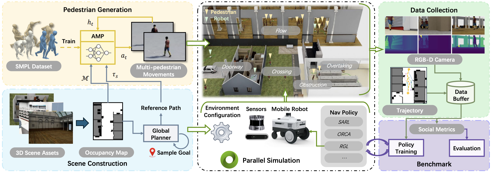
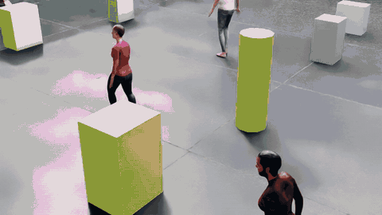
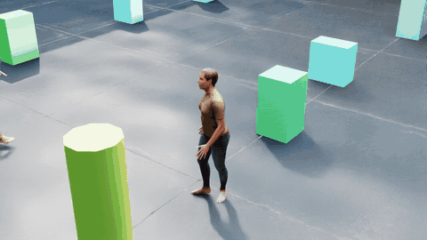
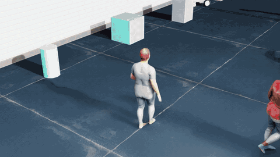
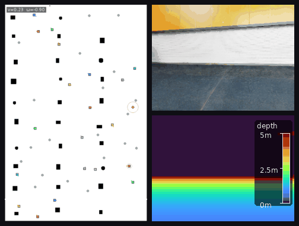

# NavIsaacLab 2.0

NavIsaacLab 2.0 provides a training and evaluation stack for human-aware robot navigation in simulated shared human-robot environments. Built on Isaac Lab and ProtoMotions, it supports GPU-parallel simulation, rgb&depth visual observations, navigation environments, PPO, and evaluation tools for studying navigation around dynamic pedestrians. The repository includes the complete Isaac Lab + ProtoMotions CrowdSim training and evaluation pipeline. For the full simulator workflow, see [FULL_PIPELINE.md](FULL_PIPELINE.md) and [CrowdSim/ppo/README.md](CrowdSim/ppo/README.md).



## Links

- [Project website](https://broln7.github.io/NavIsaacLab-web/)
- [Paper](https://arxiv.org/abs/2606.26265)
- **Accepted by IEEE Transactions on Automation Science and Engineering (T-ASE).**

## Demo

#### Diverse pedestrian motion generation

<p align="center">
  
  
  <br />
  
  
</p>

*The environment provides domain randomization of pedestrian appearance, posture, and motion to train end-to-end social navigation policies.*

#### Crowdnav PPO rollout


*The system supports parallel policy rollouts, observation collection, and policy training across multiple robots.*

#### Multi-sensor realistic rendering



*The observation information includes the robot's state, photorealistic RGB and depth renderings, and a local occupancy map.*

#### Sim to Real


## Included

- Multimodal actor-critic with vector, neighbor, depth, and local-map encoders
- Bounded differential-drive actions
- PPO rollout buffer and trainer
- Success-rate goal curriculum with checkpointable state
- Batched PointGoal navigation with moving neighbors
- Training, checkpoint/resume, and evaluation CLIs
- JSON configuration and smoke tests

## Installation

```bash
python -m pip install -e ".[test]"
```

## Train

```bash
crowdsim-ppo-train --config configs/point_goal.json
```

For a quick smoke run:

```bash
crowdsim-ppo-train \
  --config configs/point_goal.json \
  --total-steps 32768 \
  --output output/smoke
```

Training prints one JSON metrics record per PPO update and writes:

```text
output/point_goal_ppo/
├── config.json
├── checkpoint_<step>.pt
└── latest.pt
```

Resume from a checkpoint:

```bash
crowdsim-ppo-train \
  --config configs/point_goal.json \
  --resume output/point_goal_ppo/latest.pt
```

## Evaluate

```bash
crowdsim-ppo-eval \
  --config configs/point_goal.json \
  --checkpoint output/point_goal_ppo/latest.pt \
  --episodes 200
```

Evaluation uses the bounded policy mean and reports success rate, collision rate,
mean episode return, and mean episode length.

## Pipeline

```text
batched environment
  -> vector + nearest-neighbor observations
  -> actor-critic action/value inference
  -> rollout buffer
  -> GAE returns and normalized advantages
  -> clipped PPO actor loss + value loss + entropy bonus
  -> checkpoint and deterministic evaluation
```

The normalized action is `[linear_velocity, angular_velocity]`, with ranges
`[0, 1]` and `[-1, 1]`. The reference environment maps these values to unicycle
linear and angular velocity limits.

## Minimal example

```python
import torch

from crowdsim_ppo import RobotActorCritic

model = RobotActorCritic(
    obs_dim=4,
    action_dim=2,
    hidden_dims=(128,),
    map_enabled=False,
    depth_enabled=False,
    num_neighbors=4,
)

batch_size = 8
obs = torch.zeros(batch_size, 4)
neighbors = torch.zeros(batch_size, 4, 5)
neighbor_mask = torch.zeros(batch_size, 4, dtype=torch.bool)

action, raw_action, log_prob, value = model.act(
    obs,
    neighbors=neighbors,
    neighbor_mask=neighbor_mask,
)
```

## Repository layout

```text
configs/point_goal.json          Default environment and PPO settings
src/crowdsim_ppo/point_goal_env.py  Vectorized reference environment
src/crowdsim_ppo/ppo_policy.py      Network, rollout buffer, PPO update
src/crowdsim_ppo/goal_curriculum.py Goal curriculum and state restore
src/crowdsim_ppo/train.py           End-to-end training loop
src/crowdsim_ppo/evaluate.py        Deterministic evaluation
```

## License

Apache License 2.0. See [LICENSE](LICENSE).
